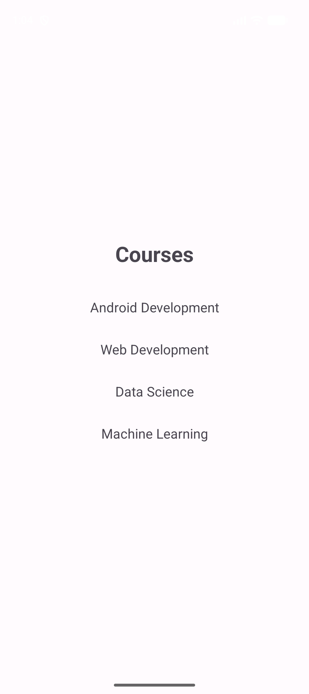

# LAB 3 - FRAGMENTS: Adaptive List-Detail Flow

## Overview
This project, **LAB 3**, explores the implementation of an adaptive **Master-Detail pattern** using Android Fragments and the `SlidingPaneLayout` component. The application demonstrates how to build a responsive UI that seamlessly transitions between different screen sizes and orientations.

## Core Experiments

### 1. Adaptive UI with SlidingPaneLayout
The application uses `SlidingPaneLayout` in the `MainActivity` to host a list of items and their corresponding details. This component handles the adaptive logic automatically:
*   **Dual-Pane Mode (Tablets/Foldables)**: Displays the `ItemListFragment` and `ItemDetailFragment` side-by-side.
*   **Single-Pane Mode (Phones)**: Displays the list fragment by default. Selecting an item "slides" in the detail fragment.

### 2. Fragment-Based Architecture
The UI is divided into two modular fragments:
*   **ItemListFragment**: Displays a centered list of available courses with a bold heading.
*   **ItemDetailFragment**: Displays detailed information about the selected course, with content perfectly centered.

### 3. Shared State Management (ViewModel)
Communication between the list and detail fragments is handled through a shared `MainViewModel`. This ensures that the detail view always reflects the currently selected item without direct coupling between fragments.

```kotlin
// Selecting a course in ItemListFragment
viewModel.selectCourse(course)
// Opening the detail pane
slidingPaneLayout.openPane()
```

## Concept & Technology
*   **SlidingPaneLayout**: Modern standard for building adaptive list-detail interfaces.
*   **ViewModel & LiveData**: Lifecycle-aware data management for fragment communication.
*   **RecyclerView**: Efficiently displaying the master list of courses.
*   **OnBackPressedDispatcher**: Handling custom back navigation to close the detail pane on smaller screens.

## Project Structure
```text
TestApp/
├── app/src/main/
│   ├── java/com/example/testapp/
│   │   ├── MainActivity.kt        # Adaptive navigation & pane control
│   │   ├── ItemListFragment.kt    # Master list view
│   │   ├── ItemDetailFragment.kt  # Detail view
│   │   ├── CourseAdapter.kt       # RecyclerView adapter
│   │   ├── MainViewModel.kt       # Shared state management
│   │   └── Course.kt              # Data model
│   └── res/
│       └── layout/
│           ├── activity_main.xml  # SlidingPaneLayout host
│           ├── fragment_item_list.xml # List UI with centered heading
│           └── fragment_item_detail.xml # Detail UI with centered text
```

## Result
Below is the output of the "Courses" menu implemented in this lab:



---
*Created as part of the LAB 3 Android Fragments experiment.*
