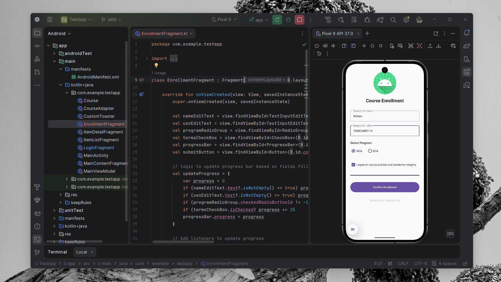

# Course Management & Enrollment System

## Overview
A comprehensive Android application featuring a secure-style login, high-priority notifications, and a dedicated student enrollment system.

## Core Features
- **Material Login**: Secure entry with field validation.
- **Priority Notifications**: Heads-up (popup) and panel-based login alerts with sound/vibration.
- **Course Enrollment (Experiment 6)**: A thematic form using basic Views (`EditText`, `RadioGroup`, `CheckBox`, `ProgressBar`) to capture student data.
- **Adaptive Course Dashboard**: Responsive list-detail view for tablets and phones.

## Technology Stack
- Navigation Component
- ViewModel
- Notification Channels
- ConstraintLayout

## Project Structure
```text
TestApp/
├── app/src/main/
│   ├── java/com/example/testapp/
│   │   ├── MainActivity.kt
│   │   ├── LoginFragment.kt
│   │   ├── EnrollmentFragment.kt
│   │   ├── ItemListFragment.kt
│   │   ├── ItemDetailFragment.kt
│   │   └── CustomToaster.kt
│   └── res/layout/
│       ├── fragment_login.xml
│       ├── fragment_enrollment.xml
│       ├── fragment_item_list.xml
│       └── fragment_item_detail.xml
```

## Output Section


---
*Developed for Android Application Development.*
