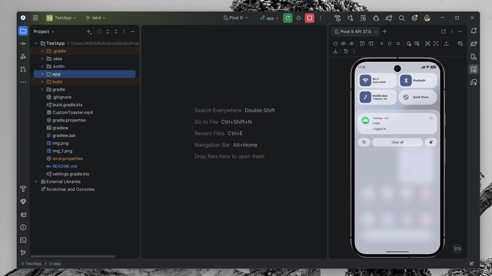
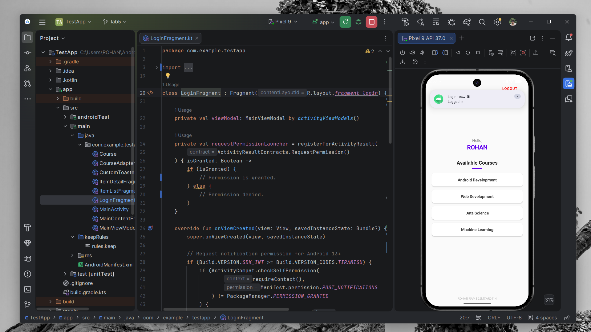

# Android Notifications & Permissions Experiment

## Overview
This project demonstrates the implementation of a robust **Android Notification System**, focusing on modern permission handling (Android 13+) and channel-based alerts. The experiment integrates system-level notifications and custom visual feedback into a secure login flow.

## Key Features

### 1. High-Priority Notification System
Upon a successful login, the application triggers a high-priority system notification to provide immediate feedback:
*   **System Notification**: A high-priority alert that appears as a Heads-up (popup) notification and then settles in the device's notification panel, stating "Login: Logged In".
*   **Persistent Tracking**: The notification remains in the tray for the user to review until dismissed.

### 2. Runtime Permission Handling (Android 13+)
The application includes a proactive permission management system for modern Android versions:
*   **POST_NOTIFICATIONS**: The app checks for and requests the required notification permission on devices running Android 13 (API 33) or higher.
*   **Permission Launcher**: Utilizes `ActivityResultContracts.RequestPermission()` for a clean, non-blocking user experience.

### 3. Notification Channels (Android 8.0+)
To ensure compatibility across all modern Android versions, a dedicated **Notification Channel** is established in the `MainActivity`:
*   **Channel ID**: `login_notifications_high`
*   **Importance**: Set to `IMPORTANCE_HIGH` to enable Heads-up (popup) notifications.

## Technology Stack
*   **NotificationManagerCompat**: A Jetpack library component for consistent notification delivery.
*   **NotificationCompat.Builder**: Advanced builder for crafting rich notification content.
*   **Runtime Permissions API**: Handling user-granted system access.
*   **CustomToaster**: A specialized utility for branded, centered toast notifications.

## Project Structure
The notification logic is integrated across several key architectural points:

```text
TestApp/
├── app/src/main/
│   ├── java/com/example/testapp/
│   │   ├── MainActivity.kt        # Notification Channel initialization
│   │   └── LoginFragment.kt       # Permission logic & Notification triggers
│   ├── AndroidManifest.xml        # POST_NOTIFICATIONS permission declaration
│   └── res/values/
│       └── strings.xml            # Notification title and text resources
```

## Implementation Snippet
```kotlin
private fun showLoginNotification() {
    val builder = NotificationCompat.Builder(requireContext(), MainActivity.CHANNEL_ID)
        .setSmallIcon(R.drawable.ic_launcher_foreground)
        .setContentTitle("Login")
        .setContentText("Logged In")
        .setPriority(NotificationCompat.PRIORITY_HIGH) // Set to high for popup
        .setAutoCancel(true)

    NotificationManagerCompat.from(requireContext()).notify(1001, builder.build())
}
```

## Output Result
Below is the visual result of the implemented notification system:




---
*Created as an experiment in Android Notification Systems and Runtime Permissions.*
