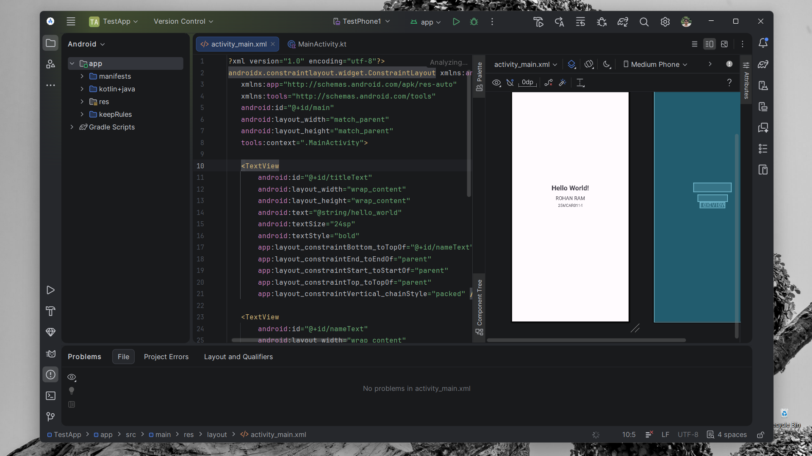

# TestApp - Activity Lifecycle & Custom UI Experiment

## Overview
This project is an advanced exploration of the **Android Activity Lifecycle** and custom UI components. It demonstrates how to track activity state transitions and visualize them using a highly customized, non-standard Toast notification system.

## Core Experiments

### 1. Activity Lifecycle State Tracking
The application implements all major lifecycle callback methods to demonstrate the Android Activity state machine. Each state transition triggers a notification, allowing for real-time monitoring of how the OS manages the application.

*   **States Tracked**: `onCreate`, `onStart`, `onRestart`, `onResume`, `onPause`, `onStop`, `onDestroy`.
*   **Demonstration**: Open the app, press Home, return to the app, and close it to see the sequence of states:
    *   *Resume*: Shows "Name : Rohan Ram"
    *   *Pause*: Shows "USN : 25MCAR0114"
    *   *Start*: Shows "Application Started"

```kotlin
override fun onResume() {
    super.onResume()
    CustomToaster.show(applicationContext, "Name : Rohan Ram ", Toast.LENGTH_LONG)
}
```

### 2. Custom Toaster Architecture
Instead of using the standard Android `Toast`, this project implements a `CustomToaster` utility that provides a modern, branded look.

*   **Positioning**: High-visibility placement at the top of the screen (`Gravity.TOP`).
*   **Visual Design**:
    *   **Background**: A linear gradient (`#EDE7FF` to `#FFFFFF`) with rounded corners (20dp).
    *   **Accent**: A purple dot indicator (`#7B61FF`) for visual interest.
    *   **Typography**: Clean `sans-serif-medium` text with optimized letter spacing.
    *   **Depth**: Subtle elevation (6dp) for a "floating" effect.

```kotlin
// Usage in MainActivity
CustomToaster.show(applicationContext, "Message", Toast.LENGTH_LONG)
```

## Concept & Technology
*   **Edge-to-Edge Display**: Drawing behind system bars for a seamless visual experience.
*   **Layout Inflation**: Using `LayoutInflater` to dynamically inject custom XML layouts into system components.
*   **ConstraintLayout**: Precise positioning of main UI elements using vertical packed chains.
*   **Kotlin & Jetpack**: Built with modern Android standards and Kotlin-first logic.

## Project Structure
```text
TestApp/
├── app/src/main/
│   ├── java/com/example/testapp/
│   │   ├── MainActivity.kt        # Lifecycle overrides & logic
│   │   └── CustomToaster.kt       # Custom notification utility
│   └── res/
│       ├── layout/
│       │   ├── activity_main.xml  # Primary UI
│       │   └── layout_custom_toast.xml # Toast UI definition
│       └── drawable/
│           ├── bg_custom_toast.xml # Gradient background
│           └── bg_toast_dot.xml    # Accent dot shape
```

## Output
Below is the visual representation of the application:



---
*Created as part of an Android development experiment.*
