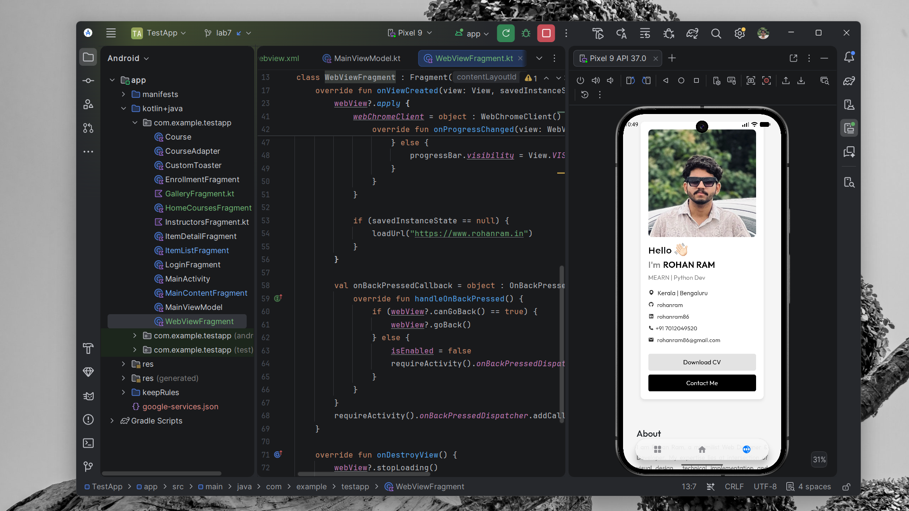

# TestApp - Portfolio WebView & Advanced Interactive Gallery

A modern Android application showcasing an embedded **Portfolio WebView** and a feature-rich **3x3 Interactive Gallery** built with custom Android Menus (**Options Menu**, **Context Menu**, **Popup Menu**), local device photo picking, web URL image loading, and an iOS-style floating glass navigation bar.

---

## 🚀 Key Modules & Highlights

### 1. Portfolio WebView Integration
- **Embedded Web Engine**: A dedicated WebView screen displaying the developer's live portfolio at [`https://www.rohanram.in`](https://www.rohanram.in).
- **Smooth Page Loading**: Integrated horizontal `ProgressBar` tracking real-time web page rendering progress.
- **Web History Back Navigation**: Custom `OnBackPressedCallback` handling in-page web history navigation (`canGoBack()`).
- **Enhanced Settings**: Enabled JavaScript, DOM storage, and viewport scaling for desktop-class portfolio rendering.

---

### 2. Interactive 3x3 Square Grid Gallery
- **Strict 1:1 Aspect Ratio**: Every image card in the 3x3 grid is locked to a 1:1 square ratio (`app:layout_constraintDimensionRatio="1:1"`) with zero distortion.
- **Flexible Image Source Slots**:
  - **Slots 1–3**: Default app showcase photos ("Campus Life", "Tech Workshop", "Library & Labs").
  - **Slots 4–6**: Local Device Photos with `+` placeholder cards. Uses `ActivityResultContracts.GetContent()` to pick images from device storage or auto-detect pushed SD card files (`1.jpg`–`6.jpg`).
  - **Slots 7–9**: Web URL Photos with `+` placeholder cards. Opens an input dialog prompting for direct web image URLs loaded via **Coil**.
- **Tactile Long-Press Micro-Animation**: Long-pressing any image card triggers a scale transformation bounce animation (`scaleX`/`scaleY` 1.0 $\rightarrow$ 0.90 $\rightarrow$ 1.0) before opening actions or entering selection mode.
- **Multi-Selection Mode**: Long-press or tap in selection mode highlights cards with blue borders and `✓` checkmark badges, displaying a floating multi-select bar.

---

## 📋 Comprehensive Android Menu Implementations

The Gallery screen implements all three fundamental Android Menu types:

### A. Options Menu (Top Header Toolbar)
Accessible via the top-right header `MaterialToolbar` (`menu_gallery_options.xml`):
- **Add Grid Box**: Dynamically appends extra 1:1 image slot boxes to the grid layout.
- **Remove Grid Box**: Removes the last added extra grid slot box.
- **Reset All Added Images**: Clears all user-added local device & web photos, custom captions, and starred favorites back to defaults.
- **Gallery Info**: Displays an alert dialog summarizing storage scanner stats, device photo counts, starred items, and total grid slots.

### B. Context Menu (Individual Image Card Long-Press)
Triggered by long-pressing an individual image card or selecting individual options (`menu_gallery_context.xml`):
- **View Image Details / Picture Info**: Displays an alert dialog showing slot index, photo name, star status, and URI/URL source path.
- **Change Name**: Prompts with an `EditText` dialog to customize the photo caption name.
- **Remove Photo**: Clears the image from the selected card slot.

### C. Popup Menu (Multi-Select Batch Actions & Card Overflow)
Anchored to the `⋮` overflow buttons or the multi-select batch action bar (`menu_gallery_popup.xml`):
- **Picture Info**: Shows detailed information for the selected image(s).
- **Share Selected Photo**: Triggers the system Android Share Intent (`ACTION_SEND`) with image links or URIs.
- **Delete Selected Photo**: Removes/clears all selected photos at once.
- **Star / Fav Selected Img**: Toggles favorite star status (`⭐` badge indicator) across all selected images.

---

## 🎨 iOS-Style Floating Glass Navigation Bar
- **Floating Pill Shape**: Positioned 24dp above the screen bottom with 28dp rounded corners and soft drop shadow elevation.
- **Perfect Geometric Alignment**: Custom layout centering 24x24dp vector icons dead-center inside the 56dp pill.
- **Smooth Page Transitions**: Integrated with `ViewPager2` for horizontal slide page switching and haptic tap feedback.

---

## 📸 Output & Results Screenshots

### 1. Portfolio WebView

### 2. Gallery - Options Menu

### 3. Gallery - Context Menu

### 4. Gallery - Popup Menu

---

## 🛠️ Technology Stack
- **Kotlin**: Primary development language.
- **Coil**: Fast, modern image loading and crossfade transformations.
- **Jetpack Navigation & ViewPager2**: Page sliding and fragment navigation.
- **Android Menus**: Options Menu, Context Menu, Popup Menu (`PopupMenu`).
- **MediaStore & ActivityResultContracts**: System photo picking and SD card storage scanning.
- **Material Design 3**: MaterialToolbar, MaterialCardView, ConstraintLayout.

---
*Developed as part of an Advanced Android Mobile Application Architecture & UI/UX Design Project.*
