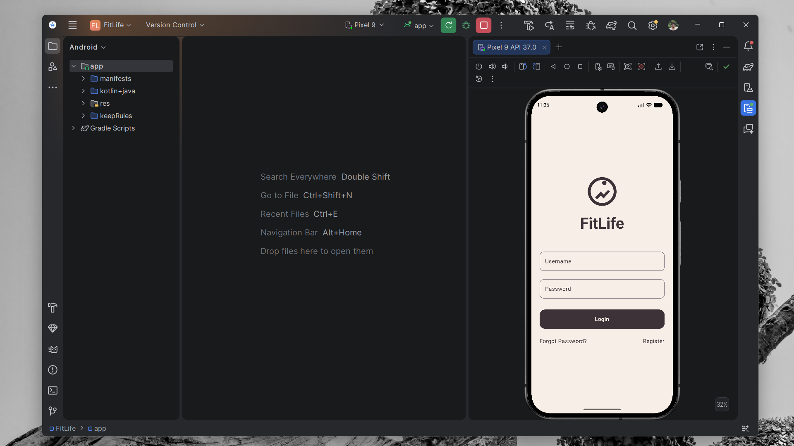
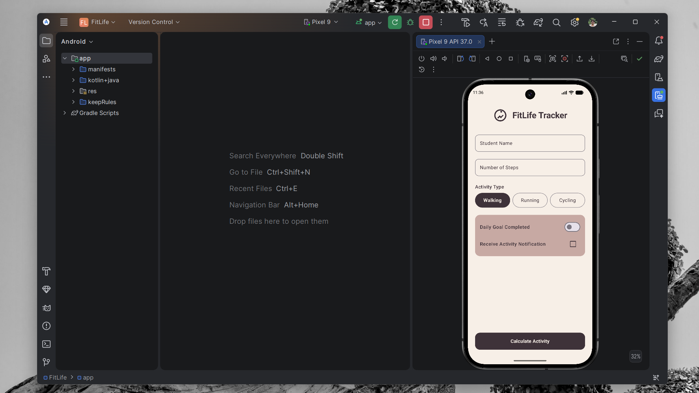
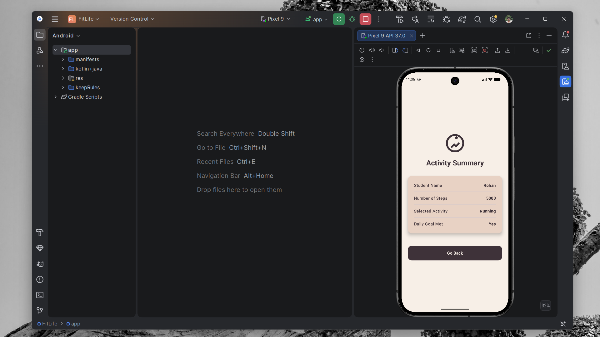
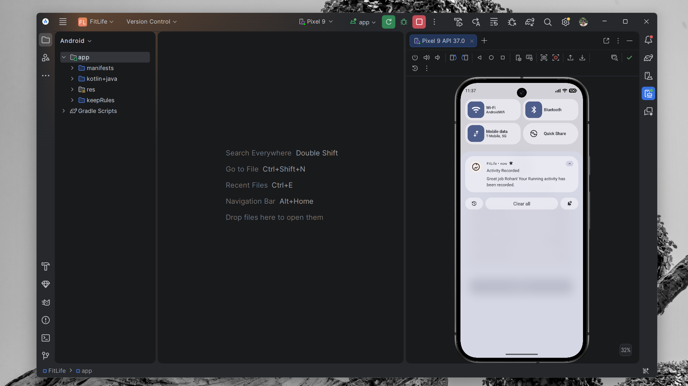

# FitLife - Android Activity Tracker

## 📱 Scenario & Overview
**FitLife** is a sleek, modern Android application designed for students and fitness enthusiasts to log their daily physical activities. Built using **Jetpack Compose**, the app serves as a robust demonstration of core Android concepts including:
- **Activity Lifecycles:** Thorough logging of `onCreate`, `onStart`, `onResume`, `onPause`, `onStop`, and `onDestroy` across all screens to understand Android's activity state management.
- **Intents & Data Passing:** Seamlessly passing data (Student Name, Steps, Activity Type, Daily Goal) between Activities using explicit Intents and Extras.
- **Notifications:** Implementation of Android 13+ runtime permissions and Notification Channels to dispatch local alerts when an activity is recorded.
- **Modern UI & Animations:** Utilizing Jetpack Compose for a declarative, production-grade UI, paired with the AndroidX Core SplashScreen API and custom XML window transition animations (slide & fade).

## ✨ Features
1. **Splash Screen:** A branded launch screen using the new AndroidX `core-splashscreen` API.
2. **Login Screen (`LoginActivity`):** A polished entry point featuring username/password fields and sleek entrance animations.
3. **Activity Form (`MainActivity`):** The core tracker where users can input their step count, pick an activity via a custom Segmented Button (Walking, Running, Cycling), set a daily goal, and opt-in to system notifications.
4. **Summary Dashboard (`ResultActivity`):** A sleek receipt-style dashboard that parses Intent data and displays the recorded metrics with bouncy physics-based entry animations.

---

## 📸 Screenshots
*(Ensure the images `ss1`, `ss2`, `ss3`, and `ss4` are placed in the root of the project or update the paths accordingly)*

<div align="center">
  
  &nbsp;&nbsp;&nbsp;
  
  &nbsp;&nbsp;&nbsp;
  
  &nbsp;&nbsp;&nbsp;
  
</div>

---

## 📂 Folder Structure

The project strictly follows the recommended modern Android architecture:

```text
FitLife/
├── app/
│   ├── src/
│   │   ├── main/
│   │   │   ├── AndroidManifest.xml       # App configuration, permissions & registered activities
│   │   │   ├── java/com/example/fitlife/
│   │   │   │   ├── LoginActivity.kt      # Launcher activity (Login screen)
│   │   │   │   ├── MainActivity.kt       # Core tracking form and Notification logic
│   │   │   │   ├── ResultActivity.kt     # Dashboard displaying Intent data
│   │   │   │   └── ui/theme/             # Jetpack Compose styling (Color.kt, Theme.kt, Type.kt)
│   │   │   ├── res/
│   │   │   │   ├── anim/                 # Custom XML transitions (slide in/out)
│   │   │   │   ├── drawable/             # Vector assets (ic_fitness_logo)
│   │   │   │   ├── mipmap/               # Adaptive App Icons
│   │   │   │   └── values/               # XML Themes (Splash Screen setup)
│   ├── build.gradle.kts                  # App-level build configurations
├── gradle/
│   └── libs.versions.toml                # Centralized dependency management
├── build.gradle.kts                      # Project-level build configurations
└── settings.gradle.kts                   # Project settings
```

## 🚀 Getting Started
1. Open the project in **Android Studio**.
2. Sync the Gradle files if prompted.
3. Run the app on an Emulator or a connected physical Android device.
4. To view the **Activity Lifecycle Logs**, open the **Logcat** window in Android Studio and filter by `Lifecycle` (e.g., `LoginActivityLifecycle`, `MainActivityLifecycle`). Watch the logs output in real-time as you navigate through the app!