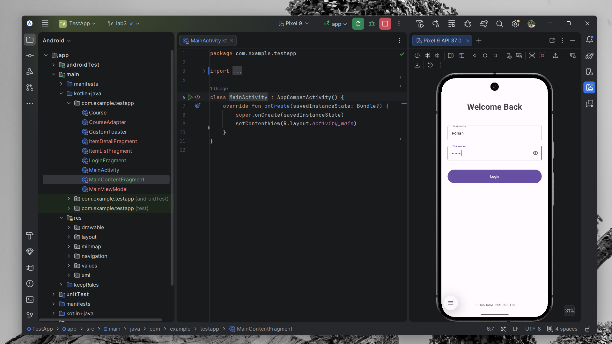
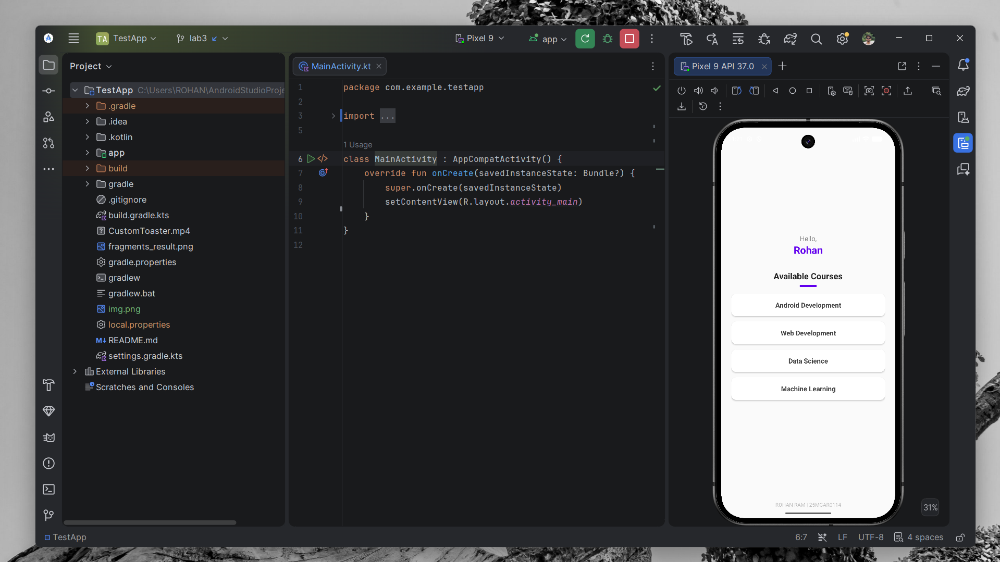

# LAB 3: Adaptive Navigation & Personalized Fragments

## Overview
This project, **LAB 3**, is a comprehensive exploration of modern Android development patterns. It implements a complete user journey starting from a **Material Design Login** screen to a **Personalized Adaptive Dashboard**. The application is designed to be fully responsive, catering to both handheld devices and large-screen formats like tablets and foldables.

## Key Features

### 1. Secure-Style Login Flow
The entry point of the application is a refined login screen built with Material Design components.
*   **Validation**: Simple check ensuring username and password fields are populated.
*   **Navigation**: Powered by the Jetpack Navigation Component with a clean backstack (the user cannot return to the login screen after entering the app).

### 2. Personalized Experience
Using a shared **ViewModel** architecture, the application captures the user's name during login and carries it into the main experience.
*   **Dynamic Greeting**: The home screen welcomes the specific user (e.g., "Hello, Rohan") with a clear color-coded text hierarchy.

### 3. Adaptive Master-Detail Pattern
The core of the "Courses" module is built using `SlidingPaneLayout`, providing an industry-standard adaptive experience:
*   **Phone (Single-Pane)**: Displays the list, then slides the detail view over it when an item is selected.
*   **Tablet/Foldable (Dual-Pane)**: Displays both the list and the details side-by-side automatically.

### 4. Professional UI/UX Design
The application features a modern aesthetic with:
*   **Centered Alignment**: Content is perfectly positioned in the middle of the screen for balanced visuals.
*   **Color Hierarchy**: Strategic use of Primary Purple for personalization and muted tones for secondary information.
*   **Material Cards**: Course items are housed in elevated cards with interactive indicators.

## Technology Stack
*   **Fragments & Navigation**: Fully modular architecture using `NavHostFragment`.
*   **ViewModel & LiveData**: Reactive state management for cross-fragment communication.
*   **SlidingPaneLayout**: Native Android support for adaptive UI.
*   **ConstraintLayout**: Advanced positioning and centering logic.

## Project Structure
```text
TestApp/
├── app/src/main/
│   ├── java/com/example/testapp/
│   │   ├── MainActivity.kt        # Lightweight Navigation Host
│   │   ├── LoginFragment.kt       # User entry & validation
│   │   ├── MainContentFragment.kt # Host for Adaptive UI
│   │   ├── ItemListFragment.kt    # Personalized Master List
│   │   ├── ItemDetailFragment.kt  # Centered Detail View
│   │   └── MainViewModel.kt       # Shared App State
│   └── res/
│       ├── navigation/
│       │   └── nav_graph.xml      # App flow definition
│       └── layout/
│           ├── fragment_login.xml # Material Login UI
│           ├── fragment_item_list.xml # Adaptive List UI
│           └── fragment_item_detail.xml # Centered Details
```

## Output Result
Below are the visual results of the implemented application:

### Application Interface


### Adaptive Detail View


---
*Created as part of the LAB 3 Android Fragments & Navigation experiment.*
