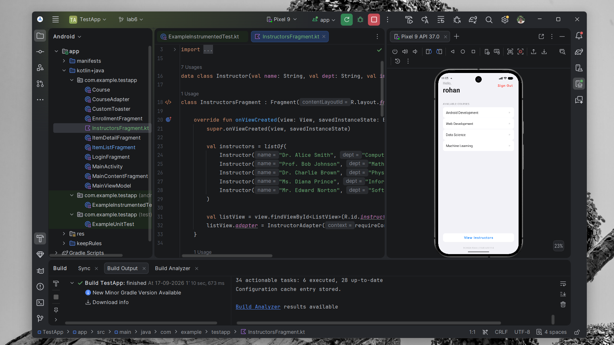
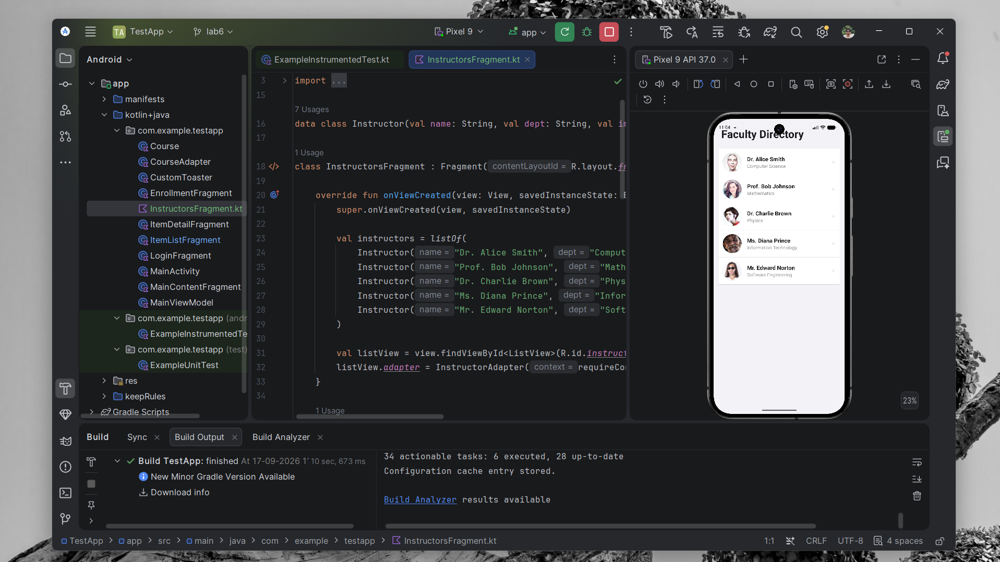

# Modern Android App: iOS-Style Theme & Dynamic Integration

## Overview
A high-fidelity Android application featuring an elegant **iOS-inspired redesign**, dynamic content integration, and advanced navigation patterns. This project showcases a complete visual overhaul and the implementation of professional-grade features like dynamic image loading and adaptive UI.

## Core Features Implemented Today

### 1. Modern iOS-Style Redesign
The entire application has been visually transformed to adopt a premium, clean aesthetic:
- **Premium Typography**: Implementation of large, bold system-style headers (34sp+) across all screens.
- **High Corner Radius**: Softened the UI with modern **14dp-20dp** rounding on cards, buttons, and input fields.
- **Grouped Form Layouts**: The Enrollment screen uses a "Grouped" card aesthetic, mimicking the iOS settings and form-entry experience.
- **Surface & Elevation**: Switched to a pure white surface palette with subtle shadows and a soft grey background (#F2F2F7).

### 2. Dynamic Faculty Directory (Coil Integration)
Integrated the **Coil** image loading library to create a dynamic, high-quality instructor directory:
- **Random Avatars**: Automatically fetches unique, high-resolution faces for each instructor from `i.pravatar.cc`.
- **Circular Portraits**: Real-time image transformation for perfectly circular, pro-level profile pictures.
- **Efficient Loading**: Leverages Coil's performance for smooth scrolling and crossfade effects.

### 3. Comprehensive Navigation & Logic
- **Material Login**: A refined login flow with field validation and "Sign Out" capabilities.
- **Course Enrollment**: A relatable thematic form showcasing basic views (RadioGroup, CheckBox, ProgressBar) in a modern context.
- **Adaptive Dashboard**: A fully responsive architecture using `SlidingPaneLayout` to support handheld and large-screen devices.

## Technology Stack
- **Coil**: Modern image loading and transformation.
- **Navigation Component**: Modular fragment-based routing.
- **ViewModel & LiveData**: Reactive state management.
- **Material Design Components**: Foundation for the premium UI elements.
- **ConstraintLayout**: Complex, responsive positioning.

## Project Structure
```text
TestApp/
├── app/src/main/java/com/example/testapp/
│   ├── MainActivity.kt        # Notification Channel & Host
│   ├── LoginFragment.kt       # iOS-Style Login logic
│   ├── EnrollmentFragment.kt  # Grouped form logic
│   ├── InstructorsFragment.kt # Dynamic Coil integration
│   ├── ItemListFragment.kt    # Modern card-based dashboard
│   └── ItemDetailFragment.kt  # Centered detail view
└── app/src/main/res/layout/
    ├── fragment_login.xml     # iOS-inspired login UI
    ├── fragment_enrollment.xml # Grouped card form
    ├── fragment_instructors.xml # ListView with dynamic images
    └── item_instructor.xml    # Symmetrical row design
```

## Output Result
Below is the visual result of today's implementation:

### 1. Dashboard & Login UI


### 2. Faculty Directory (Dynamic Avatars)


---
*Created as part of an Advanced Android UI/UX Experiment.*
